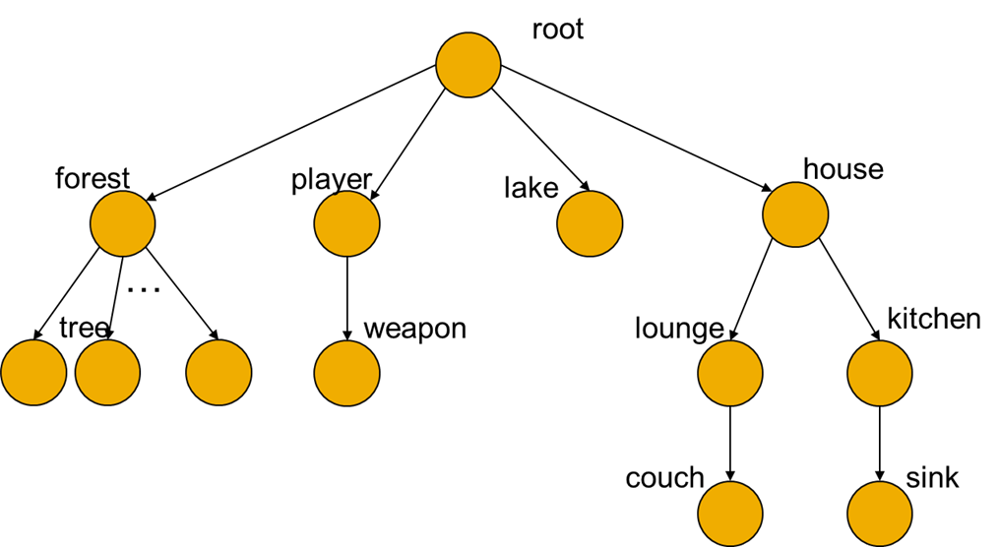
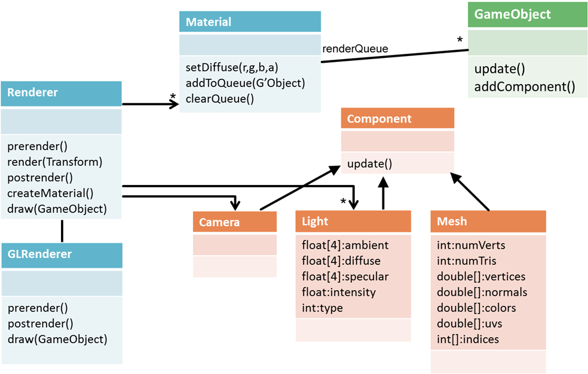
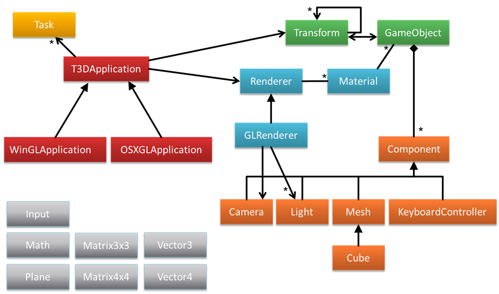

# T3D Graphics Engine

## API Documentation
Open the generated documentation in a browser -- `T3D/T3D/API_Documentation/html/index.html`;

## Getting Started
- Open the Visual Studio `.sln`
- Build the project -- preferably in Debug mode 
- Check out `T3DTest.cpp` for a complex 3D scene to get started.

## Overall Structure
The main components are the application framework (red), the renderer (blue), the scene graph (green), the component system (orange), and various helper classes (grey). The T3DApplication class is an abstract base class that provides a wrapper for all of the application level functionality. 
Subclasses of this provide the concrete implementation based on operating system and renderer. So far there is a Windows/OpenGL and an OSX/OpenGL version (This class is currently out of date and is not in the repository, but is available upon request).  To create a T3D application you make a subclass of the appropriate application type (e.g. a subclass of WinGLApplication).

## Scene Graph Detail

T3D was designed from the ground up to be a “scene graph” based engine.  A scene graph is a hierarchical structure detailing the relationships between objects in the scene.  Objects in a scene graph have positions and orientations specified relative to their parent. In T3D every object is a part of the same hierarchy with every object ultimately having a special object called root as an ancestor.  In most cases a scene graph is actually a tree as shown below.
 
As with Unity3D, the Transform class is the data structure that stores and manipulated the scene graph.  A Transform stores the local (relative to parent) position and orientation as well as information about the hierarchy (the parent and children). As T3D has many cross-cutting concerns, the component aggregator `GameObject` class is used to store many components in a scene graph in T3D, such as Transforms.

## The `Component` System

Each `GameObject` can have multiple components attached to it.  Again, this is similar to the component system in Unity3D.  `Component`s can be things like Cameras, `Light`s and `Mesh`es.  A `Mesh` defines geometry to be rendered.  `Component`s are updated each frame, so they can also be used to define behaviours (e.g. animations) for an object.

## Renderer Detail

As with all parts of T3D, the renderer is designed to be cross-platform.  There is an abstract Renderer class that has hook methods for rendering.  This class also know what camera is being used (a Camera is just another component that will be attached to a game object that is attached to a transform), and what `Light`s are in the scene (another component type).
 
Subclasses of Renderer implement the specific rendering functions for the type of renderer.  So far, only an OpenGL render has been implemented.  The render method first traverses the scenegraph and adds gameObjects with a `Material` to the respective `Material`’s renderQueue.  The renderQueues are then traversed for each `Material` in order of priority (e.g. transparent objects after opaque objects) and the objects are drawn. prerender and postrender take care of renderer setup (e.g. drawing the skybox) and finalisation (e.g. swapping buffers) respectively. The draw method actually draws a game object.

## Using T3D

To create a T3D application you make a subclass of WinGLApplication (for Windows) and modify Main.cpp so that this class is constructed.  Currently Main runs a class called T3DTest and it is probably easiest to just modify this class if you are only working on one project. Other small test T3DApplications are provided.
T3DTest show examples of using the various features including the terrain, skybox, billboards, and creating meshes.  Some of these are quite different to what you are used to.

## The `Mesh` Class
The `Mesh` stores all of the data needed to render a polygon mesh (vertices, normal, texture coordinates etc.). All rendering is implemented using vertex arrays.  From a usage point of view this means that vertex data -- vertices, normals, UVS -- is packed into an array and the entire array is sent to OpenGL to be rendered.  This is somewhat like a display list, but a little more flexible.  You can look at the Cube class for an example of how to create a mesh.
Sweeps

In T3D, sweeps and extrusions have been rationalised into one class (FWIW, the “extrusions” in the KXG262 code are technically sweeps, and the “sweeps” are technically revolves).  There is a SweepPath class that stores a list of Transforms defining the path to sweep along.  Remember that Transforms store a position and orientation, so you can store any sort of path you like using this class.  There is also a helper function to make it easy to construct circular paths, which you can use to make objects of revolution (like the Sweep in KXG262).

The Sweep class takes a list of points defining the sweep shape and a sweep path and creates the sweep mesh.  If you want a closed path you can set this option to true in the constructor (it will join the end back to the beginning).   
There is currently no facility for specifying paths and shapes using text files, everything must be done in code (there is currently no plan to add this).  T3DTest shows how to create a torus shape using the SweepPath and Sweep classes.

##  Animations and other Behaviours
There are a few ways to create animations.  Either: create a new Task; add animation behaviours to game objects; or create key-frame animations.  Typically I expect a combination of all three to be used.

## Tasks
Tasks define routines that are updated by the application each frame.  There is currently only one task that is used for collecting performance info (PerfLogTask), but you could create a global animation controller as a new Task type in the same way – this would provide functionality similar to the animateForNextFrame function in the KXG262 code.

## Behaviour `Component`s
Behaviours are just like any other type of component that can be added to a game object.  There are currently a few examples in T3DTest.  For example the KeyboardController component is added to the same game object as the camera, which allows the camera to be moved using the keyboard (the usual first-person controls will move the camera).
You could create your own behaviour, as a subclass of `Component`, and add it to a `GameObject`.  This would be like creating an animate function for a composite in the KXG262 code.

## Key-frame Animations
Key-frame animations are something that didn’t exist in any form in KXG262.  They provide an easy way to create animations for composite objects (especially complex animations like walk sequences).  This is implemented through the Animation class (and also the Bone class).
An Animation is a component that can be added to a `GameObject` to control the animation of the `GameObject` and its children.  You add key frames to the animation by specifying the name of the child to be effected, the time, and the position and orientation.  When the animation is played, ti will interpolate the position and orientation for each child each frame.  There is an example in the T3DTest application.
`Material`s and Textures

## `Material` System
A `GameObject` may also have a material.  The material specifies the display properties for an object including textures.  Later, this is also where shaders will be specified.  Many game objects can share the same `Material`.
The Texture class is pretty straight forward, but one interesting feature is the ability to create a procedural (fractal in this case) texture, which can be very useful for testing (the same method is also used for generating fractal terrains).  You can see an example of using this feature in T3DTest.
Miscellaneous

## Platform
Another difference between T3D and the KXG262 code is that T3D uses SDL (Simple Direct Media Layer) rather than GLUT.  SDL does everything that GLUT does (except in a different way) and more, but you shouldn’t notice any real difference unless you are modifying core parts of the engine.

## Note on Orientations
T3D uses Quaternions to represent orientations.  These are not as complex as they seem, but in any case, you can deal with them using Euler angles (Yaw, Pitch, and Roll) through helper functions (similar to Unity3D).  

